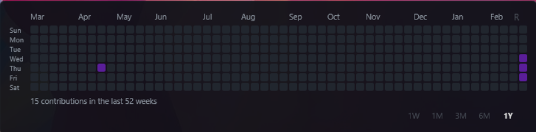

# 🌿 GitHub Grass for Rainmeter

Display your GitHub contribution graph on your Windows desktop using Rainmeter.



---

## Requirements

- [Rainmeter](https://www.rainmeter.net/) 4.x or higher
- Windows 10 / 11
- GitHub Personal Access Token

---

## Installation

**1. Copy the skin folder**
```
Documents\Rainmeter\Skins\grassmeter\
```

**2. Edit `Settings.inc`**
```ini
GitHubUsername=your_github_username
GitHubToken=ghp_xxxxxxxxxxxxxxxxxxxx
```

**3. Run `run.bat`** (double-click)
Wait ~10 seconds for data to load. The widget will appear automatically.

**4. Load `GrassView.ini` in Rainmeter Manager**
Right-click tray icon → Manage → Load `GrassView.ini`

---

## Getting a GitHub Token

1. Go to GitHub → Settings → Developer settings
2. Personal access tokens → Tokens (classic)
3. Generate new token → check `read:user` → Generate
4. Copy the token into `Settings.inc`

---

## Settings

Open `Settings.inc` to customize. After editing, click the **R** button on the widget to apply.

### GrassView

| Setting | Default | Description |
|---------|---------|-------------|
| `GitHubUsername` | — | Your GitHub username |
| `GitHubToken` | — | GitHub Personal Access Token |
| `ColorTheme` | `Green` | Color theme (see below) |
| `CellSize` | `11` | Cell size in pixels |
| `CellGap` | `2` | Gap between cells |
| `Padding` | `14` | Widget outer padding |
| `WeeksToShow` | `52` | Weeks to display (52 = 1 year) |

### CommitView

| Setting | Default | Description |
|---------|---------|-------------|
| `Repo1` | — | Repository to track (`owner/repo`) |
| `Repo2` | — | Repository to track (optional) |
| `Repo3` | — | Repository to track (optional) |
| `AutoRefreshMin` | `5` | Auto-refresh interval in minutes (`0` = disabled) |

### Color Themes

| Theme | Description |
|-------|-------------|
| `Green` | GitHub default green |
| `Purple` | Purple tones |
| `Blue` | Blue tones |
| `Red` | Red tones |
| `Orange` | Orange tones |
| `Pink` | Pink tones |
| `Mono` | Grayscale |
| `Mint` | Teal/mint tones |
| `Yellow` | Neon yellow tones |
| `Cyan` | Neon cyan/electric blue tones |
| `Light` | Light background (GitHub light mode style) |

---

## Usage

### Period Selector Buttons

Click the period buttons on the widget to change the displayed time range:

| Button | Period |
|--------|--------|
| `1W` | Last 1 week |
| `1M` | Last 4 weeks |
| `3M` | Last 13 weeks |
| `6M` | Last 26 weeks |
| `1Y` | Last 52 weeks (default) |

The widget updates automatically — no manual refresh needed.

### R Button

Click **R** (top-right of widget) to fetch fresh data and apply any `Settings.inc` changes.

---

## Troubleshooting

**Widget not showing / blank cells**
- Make sure `run.bat` has been executed at least once
- Check `debug.log` in the skin folder

**`debug.log` says API failed**
- Verify your `GitHubUsername` and `GitHubToken`
- Token needs `read:user` permission

**PowerShell execution error**
Open PowerShell as administrator and run:
```powershell
Set-ExecutionPolicy -Scope CurrentUser RemoteSigned
```

---

## File Structure

```
grassmeter\
├── Settings.inc              ← All configuration (GrassView + CommitView)
├── Settings.inc.example      ← Template — copy and fill in credentials
│
├── GrassView\
│   ├── FetchAndBuild.ps1     ← Fetches GitHub API + generates GrassView.ini
│   ├── launcher.vbs          ← Silent background launcher
│   ├── run.bat               ← Manual run to generate widget
│   ├── SetPeriod.bat         ← Period switch (called with weeks as argument)
│   ├── SetPeriod_1W.bat      ← Shortcut: 1-week view
│   ├── SetPeriod_1M.bat      ← Shortcut: 4-week view
│   ├── SetPeriod_3M.bat      ← Shortcut: 13-week view
│   ├── SetPeriod_6M.bat      ← Shortcut: 26-week view
│   ├── SetPeriod_1Y.bat      ← Shortcut: 52-week view (default)
│   ├── GrassView.ini         ← Auto-generated (do not edit)
│   └── debug.log             ← Auto-generated (GrassView errors)
│
└── CommitView\
    ├── FetchCommits.ps1      ← Fetches GitHub API + generates CommitView.ini
    ├── launcher_commits.vbs  ← Silent background launcher
    ├── run_commits.bat       ← Manual run to generate widget
    ├── CommitView.ini        ← Auto-generated (do not edit)
    └── debug_commits.log     ← Auto-generated (CommitView errors)
```

---

## Development Status

### Completed

- [x] Core architecture: PowerShell fetches GitHub API and generates `GrassView.ini` with Shape Meters
- [x] UTF-8 BOM encoding for all INI files
- [x] Shape Meter color rendering (fill color bug fixed)
- [x] Full rewrite of `FetchAndBuild.ps1` (stable, no pipeline pollution)
- [x] 52-week (1 year) contribution graph display
- [x] Weekday labels (Sun ~ Sat)
- [x] Month labels (Jan ~ Dec)
- [x] 7 color themes (Green / Purple / Blue / Red / Orange / Pink / Mono)
- [x] Opacity setting (background transparency)
- [x] Configurable cell size, gap, padding, weeks
- [x] **R** refresh button on widget
- [x] **Period selector buttons (1W / 1M / 3M / 6M / 1Y)** — click to switch time range instantly
- [x] Silent background execution via `wscript.exe` + `launcher.vbs` (no console window flash)
- [x] Auto-refresh after script completes (`Rainmeter.exe !Refresh`)
- [x] L0 cell contrast improvement (empty cells more visible against background)
- [x] **CommitView widget** — show latest commits (up to 10) from up to 3 repositories
- [x] **CommitView auto-refresh** — configurable interval via `AutoRefreshMin` in `Settings.inc`
- [x] **Dual widget support** — GrassView and CommitView load as separate Rainmeter configs simultaneously
- [x] **Light / Mint themes** — full color palette + accent line sync across all skins
- [x] **CommitView / IssueView: section divider line aligned to content** — separator line starts at the main content column (X=MsgColX / X=TitleColX), not at the widget left edge
- [x] **CommitView: repo name ellipsis** — long repo names truncate with `...` so they don't overflow into the divider line
- [x] **GrassView: responsive bottom UI** — total text hidden when widget is too narrow (1W/1M/3M), period buttons always visible at any size; streak and legend texts clipped instead of overflowing
- [x] **GrassView: auto-detect username** — if `GitHubUsername` is blank in Settings.inc, automatically fetches login from GitHub API and saves it back

### Planned / TODO

- [ ] Opacity slider UI on widget
- [ ] GitHub OAuth Device Flow (no manual token setup)
- [ ] Auto-refresh on system startup
- [ ] `.rmskin` package for one-click install
- [ ] API error display directly on widget
- [ ] Private repo contribution toggle

---

## Development Guidelines

### Cross-skin visual consistency

All skins (GrassView, CommitView, IssueView) must share the same visual rules:

- **Divider line alignment** — Section separator lines must start at the X position of the main content column, not at `$Padding`.
  - CommitView: `X=$MsgColX` (= `$Padding + $AuthorColW + 8` = 112)
  - IssueView: `X=$TitleColX` (= `$Padding + $TypeColW + $NumColW + 4` = 88)
  - The line length is always `$lineEndX - <ContentColX>` so the right edge stays flush with the widget border.
- **Color variables** — All theme colors (`$cBG`, `$cStroke`, `$cAccent`, `$cTextName`, etc.) must be kept in sync across all `Fetch*.ps1` scripts whenever a new theme is added.
- **Widget width** — All skins use `$WW = 500` and `$Padding = 14` as the canonical values.

---

## Architecture Notes

Buttons in the widget call `wscript.exe launcher.vbs [weeks]` directly from `LeftMouseUpAction`.
This avoids the Rainmeter RunCommand plugin (which has issues with space-containing paths and arguments).
`FetchAndBuild.ps1` triggers `Rainmeter.exe !Refresh` at the end so the widget reloads automatically.

---

## Contributing

Contributions are welcome!
Check open issues labeled [`good first issue`](https://github.com/ssassu/grassmeter/issues?q=label%3A%22good+first+issue%22) to get started.

See [CONTRIBUTING.md](CONTRIBUTING.md) for guidelines.

---

## License

MIT License
